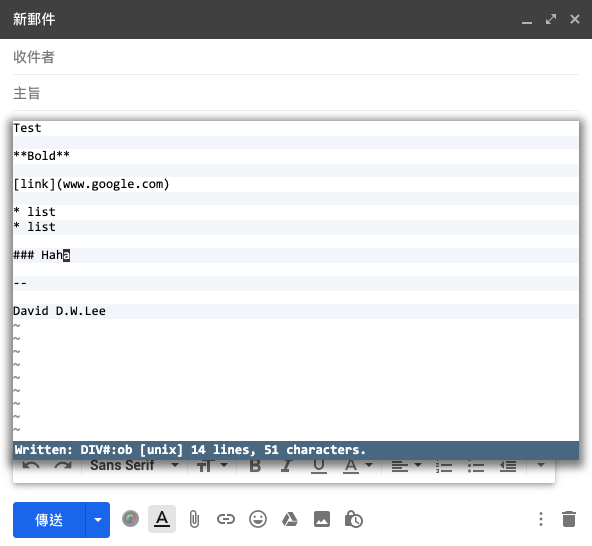
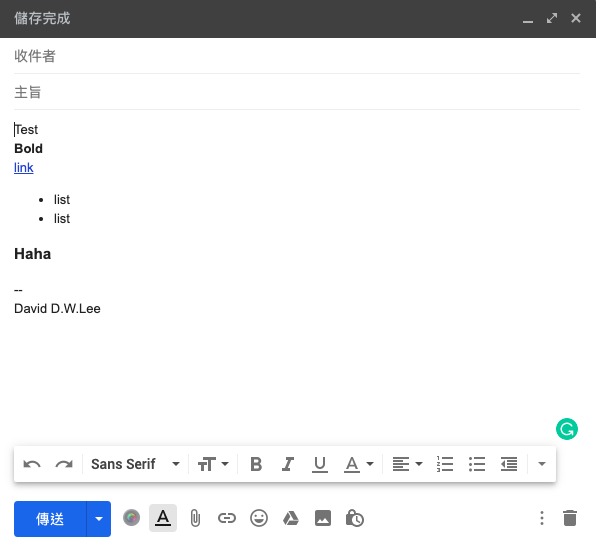

# Use Vim Everywhere

* [Enable VIM Mode in Terminal](Friends/zsh.md#Turn-on-VIM-Mode)

## Terminal File Management

* [vifm](https://vifm.info/)
  * [Vim Makes Everything Better, Especially Your File Manager And Shell!](https://youtu.be/a4scYdubKbo)
* ranger
  * [YouTube - How vim Makes my Daily Life Easier](https://youtu.be/NzD2UdQl5Gc)

## In Browser

### Edit in Browser

> * [Vim-like Editing inside Browser](https://jdhao.github.io/2019/05/11/nvim_text_input_browser/)

#### wasavi

> wasavi transforms *TEXTAREA* element of any page into a VI editor

Get **wasavi**

* [Document](http://appsweets.net/wasavi/)
* [Chrome Extension](https://chrome.google.com/webstore/detail/wasavi/dgogifpkoilgiofhhhodbodcfgomelhe/)

Basic Usage

* Enter **wasavi** mode: `Ctrl + Enter`
* Exit: `:wq`

Example of editing in GMail





### Navigating in Browswer

#### Vimium

> Vimium provides keyboard shortcuts for navigation and control in the spirit of Vim.

Get **Vimium**

* [Chrome Extension](https://chrome.google.com/webstore/detail/vimium/dbepggeogbaibhgnhhndojpepiihcmeb)
* [Github](https://github.com/philc/vimium/)

Basic Usage

```txt
?       show the help dialog for a list of all available keys
j       scroll down
k       scroll up
d       scroll down half a page
u       scroll up half a page
gg      scroll to top of the page
G       scroll to bottom of the page
F       open a link in a new tab
yy      copy the current url to the clipboard

O       Open URL, bookmark, history entry in a new tab
T       search through your open tabs
```

## Everywhere Literarily

### vim-anywhere

> Once invoked (default `Ctrl + cmommand + v`), vim-anywhere will open a buffer.
> Close it and its contents are copied to your clipboard and your previous application is refocused.

Get **vim-anywhere**

* [Github](https://github.com/cknadler/vim-anywhere)

```sh
# For mac
$ brew cask install macvim
$ curl -fsSL https://raw.github.com/cknadler/vim-anywhere/master/install | bash
```

Useful tips

vim-anywhere creates a temporary file in `/tmp/vim-anywhere` when invoked. ([explanation](https://github.com/cknadler/vim-anywhere#history))

> * [How To Use Vim Editor To Input Text Anywhere](https://www.ostechnix.com/how-to-use-vim-editor-to-input-text-anywhere/) - Introducing vim-anywhere used in Ubuntu

## Resources

* [Productivity Chronicles: Use vim everywhere!](https://jonasws.github.io/2016/02/18/use-vim-everywhere.html)
